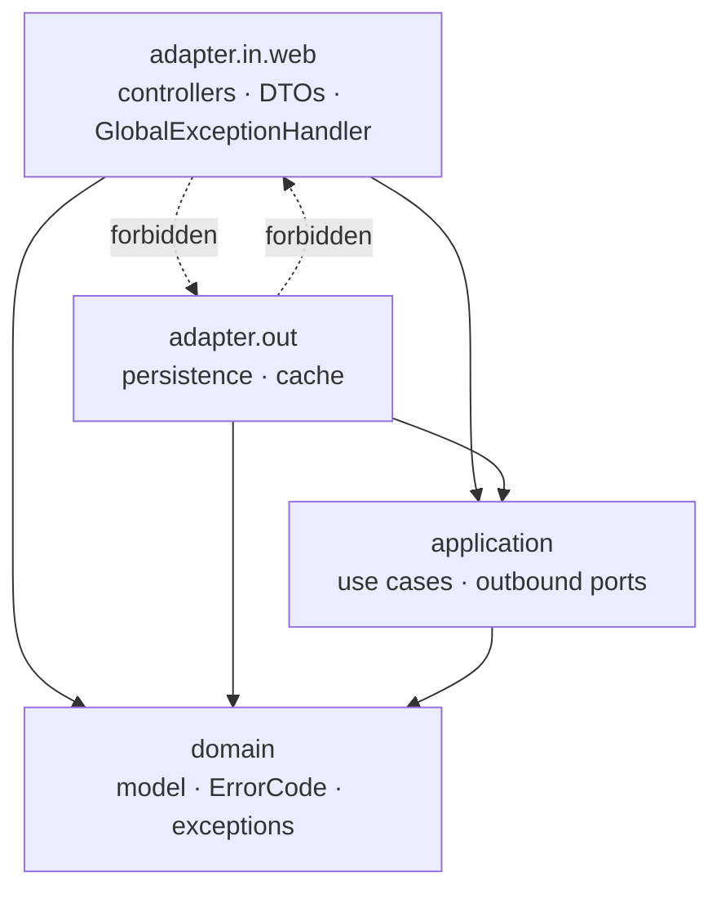
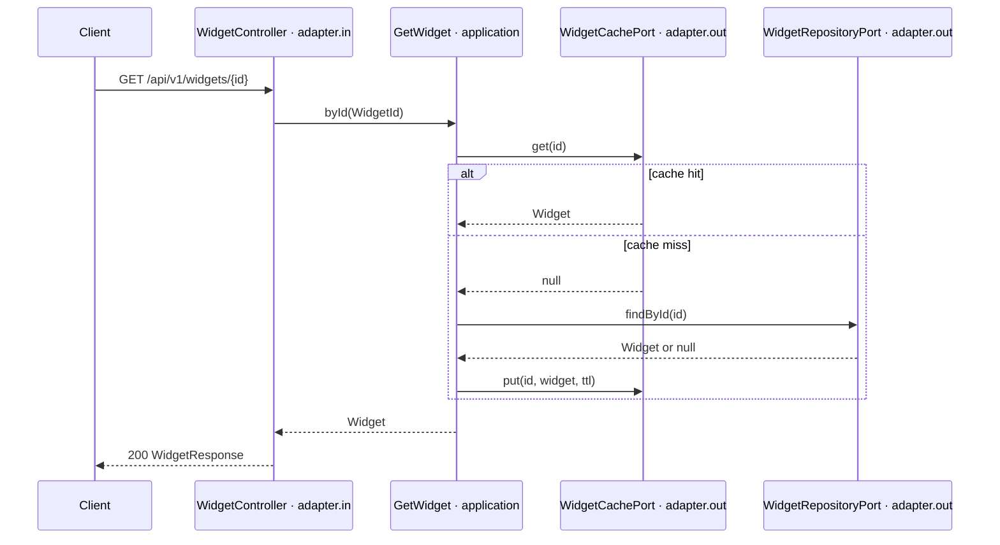
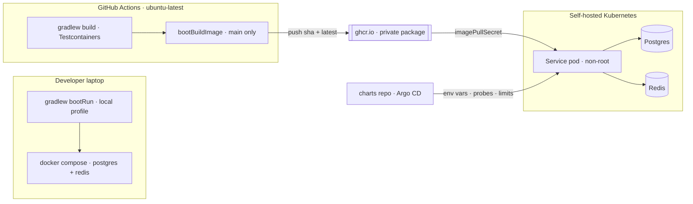

# Architecture Spine — Spring Boot Kotlin Starter Service

## Design Paradigm

**Layered clean architecture with ports and adapters, in layer-first packages.** Four layers, each a top-level package under the fixed root `com.hl.service`; a resource is a same-named subpackage inside each layer it touches. Dependencies point inward only, and that direction is a build-failing test, not a convention.



## Invariants & Rules

### AD-1 — Layer-first package layout under a fixed root `[ADOPTED]`

- **Binds:** all
- **Prevents:** two resources landing the same kind of code in different trees; an agent inventing a fifth home.
- **Rule:** Root package is `com.hl.service` for every Consumer Service and is never renamed. Layers are `domain`, `application`, `adapter.in.web`, `adapter.out.persistence`, `adapter.out.cache`. A resource `X` occupies `<layer>.x` inside each layer it needs. Cross-cutting code lives in `<layer>.shared`. Every file belongs to exactly one layer.

### AD-2 — Dependency direction is enforced by ArchUnit in `./gradlew check`

- **Binds:** all
- **Prevents:** the layering degrading into convention that erodes on the third resource.
- **Rule:** `domain` may be accessed by every layer; `application` by `adapter.in` and `adapter.out`; `adapter.in` and `adapter.out` by nothing, and never by each other. `domain.shared` is the one package all layers may depend on. Banned imports: `domain` → no `org.springframework..`, `jakarta..`, `org.hibernate..`; `application` → no `org.springframework.web..`, `org.springframework.data..`, `org.springframework.http..`, `jakarta.persistence..`, `jakarta.servlet..`, `org.hibernate..`. A violation fails the build naming the class and the rule.

### AD-3 — The application layer sees exactly two Spring annotations

- **Binds:** all use cases
- **Prevents:** either extreme — a Spring-soaked application layer, or a Spring-free one that forces every new resource to edit a shared wiring file and so breaks FR-6.
- **Rule:** Application classes may use `org.springframework.stereotype` (`@Service`/`@Component`) and `org.springframework.transaction.annotation.@Transactional`. Nothing else from Spring. The domain layer stays entirely framework-free. There is no central composition-root `@Configuration`; component scanning wires use cases.

### AD-4 — Domain model and JPA entity are distinct types `[ADOPTED]`

- **Binds:** every persisted resource
- **Prevents:** Hibernate's mutable-`var`, no-arg-constructor and lazy-proxy semantics reaching the domain and quietly hollowing out AD-2.
- **Rule:** The domain type is an immutable Kotlin class with value-class identifiers, in `domain.x`. The `@Entity` lives in `adapter.out.persistence.x`. Mapping between them is explicit hand-written code on the entity; no mapping framework is added.

### AD-5 — Outbound ports only

- **Binds:** every use case and adapter
- **Prevents:** half the resources declaring a one-implementation interface per use case and half not.
- **Rule:** `application.x` declares outbound port interfaces (`XRepositoryPort`, `XCachePort`); `adapter.out` implements them. There are **no** inbound port interfaces — controllers depend on the concrete application class.

### AD-6 — The use case owns cache-aside, not a decorator and not Spring

- **Binds:** every cached read path
- **Prevents:** three plausible cache homes across resources, and proxy-based caching that a self-invocation silently skips.
- **Rule:** The application use case injects both an `XRepositoryPort` and an `XCachePort` and performs read-through and invalidation itself. `@Cacheable`/`@CacheEvict` are not used. TTL is a configuration value with a documented default.

### AD-7 — Transaction boundary and cache write ordering

- **Binds:** every write path
- **Prevents:** uncommitted or rolled-back state being served from Redis, and per-resource disagreement about where a transaction starts.
- **Rule:** `@Transactional` appears only on application use cases — never controllers, never adapters; read paths use `readOnly = true`. The cache may be **evicted** inside a transaction (a rollback then leaves it merely cold, which is safe). The cache is **never populated inside a write transaction**.

### AD-8 — Identifiers are application-generated UUIDs in value classes

- **Binds:** every persisted entity
- **Prevents:** mixed identifier strategies, and ids that are null until flush leaking nullability through the immutable domain.
- **Rule:** Ids are `java.util.UUID` (v4, `UUID.randomUUID()`) generated in the domain before persistence, wrapped in a `@JvmInline value class` per resource. Postgres column type is `uuid`. The database never generates identifiers.

### AD-9 — One REST URL and verb convention

- **Binds:** every inbound adapter
- **Prevents:** per-resource path and versioning improvisation, and an auth matcher that cannot cleanly separate business routes from actuator.
- **Rule:** `/api/v1/{resource}`, plural lowercase. `POST` collection creates (201 + `Location`); `GET /{id}`; `GET` collection lists paged; `PUT /{id}` full update; `DELETE /{id}` returns 204. Request and response DTOs are `<Resource>Request` / `<Resource>Response` in `adapter.in.web.x`; a domain type is never serialized and never appears in a controller signature.

### AD-10 — One pagination contract, expressed in the Starter's own types

- **Binds:** every list endpoint
- **Prevents:** each resource inventing a list envelope; Spring Data types crossing into the application layer in violation of AD-2.
- **Rule:** Offset paging, `?page=` (0-based) and `?size=` (documented default). `PageRequest` and `PageResult` are the Starter's own types in `domain.shared`; the persistence adapter translates to and from Spring Data's `Pageable`/`Page`. Response envelope: `items`, `page`, `size`, `totalElements`, `totalPages`.

### AD-11 — One error body, produced in exactly one place `[ADOPTED]`

- **Binds:** every response path
- **Prevents:** a second error shape appearing for validation or for 500s; error responses being constructed in controllers or filters.
- **Rule:** Every 4xx and 5xx is RFC 7807 `application/problem+json`, built by the single `@RestControllerAdvice` in `adapter.in.web.shared`. `type` is `about:blank`; `instance` is the request path; extension members are `code` (the Error Code), `traceId`, and — for validation failures — `errors`, an array of `{field, code, message}`. 500 bodies never carry an exception message, stack trace, or internal detail; the `SystemException` is logged in full at error level with the same trace id.

### AD-12 — Error Codes are one enum; the HTTP mapping lives only in the handler

- **Binds:** all domain and application error paths
- **Prevents:** HTTP semantics leaking into the domain, and the set of errors a service can return becoming undiscoverable.
- **Rule:** `domain.shared.error.ErrorCode` is a single Kotlin enum; each constant carries a status-free `ErrorKind` (`VALIDATION`, `NOT_FOUND`, `CONFLICT`, `INTERNAL`) and a message template. `BusinessException` and `SystemException` carry an `ErrorCode` plus a parameter map and never an HTTP status. The `ErrorKind` → HTTP status map exists only in the Global Exception Handler. Clients branch on `code`, never on status or `detail` text.

### AD-13 — Redis is a hard dependency with no fallback path `[ADOPTED]`

- **Binds:** every cache adapter, readiness
- **Prevents:** a silently cold cache hiding a dead Redis, and per-resource disagreement about whether cache failures are recoverable.
- **Rule:** The cache adapter contains no try/catch and no degraded mode; a Redis failure propagates as a `SystemException` → 500. The Redis health contributor is a member of the **readiness** health group, so a pod without Redis never enters rotation. *(Overrides the PRD FR-10 assumption of degrade-to-Postgres.)*

### AD-14 — Flyway is the only schema authority

- **Binds:** all persistence
- **Prevents:** Hibernate and Flyway both claiming the schema; edited migrations diverging across environments.
- **Rule:** `spring.jpa.hibernate.ddl-auto` is `validate`. Migrations are `db/migration/V<n>__snake_case.sql`, sequential integers, never edited after merge. Checksum validation is on; auto-repair is off. Startup fails loudly on a missing or mismatched migration.

### AD-15 — All deployment-varying configuration comes from the environment

- **Binds:** all configuration
- **Prevents:** environment-specific values baked into the image, and a later Vault adoption becoming a code change.
- **Rule:** `application.yaml` holds defaults and environment-variable placeholders only. `application-local.yaml` is the sole file with literal (throwaway) credentials. The same image runs in any environment given different environment variables. No secret material anywhere else in the repo or the image.

### AD-16 — The Four Parameters, and nothing else, turn the Starter into a service `[ADOPTED]`

- **Binds:** parameterization
- **Prevents:** cloning drifting into source editing, which is the failure mode that would break the under-15-minute target.
- **Rule:** Only service name (Gradle project name), database name + credentials, HTTP port, and image name change. Each has exactly one documented home. The base package (AD-1), the layer paths, and every ArchUnit rule literal are invariant and are never touched.

### AD-17 — Observability is configuration, never code

- **Binds:** all runtime behavior
- **Prevents:** an observability code path that only exists in production and is therefore never tested.
- **Rule:** JSON logging uses Spring Boot's built-in structured logging (`logging.structured.format.console`) — no encoder dependency, no logback XML; the `local` profile keeps console output. Actuator exposes `health`, `info`, `prometheus` and nothing else, on the main port. Readiness group = datasource + Redis. Tracing is Micrometer Tracing over the OTel bridge with an OTLP exporter whose endpoint is unset by default, making it a no-op locally and in CI; sampling probability is a configuration value. Graceful shutdown is on with a 30s phase timeout. Heap is left to the buildpack's container-aware calculator; the README documents the knob.

### AD-18 — The Auth Seam is one property, and it fails safe

- **Binds:** security
- **Prevents:** `spring-security` on the classpath silently securing everything with a generated password, and an enabled seam that allows all traffic through misconfiguration.
- **Rule:** `app.auth.enabled` (default `false`) selects one of two `SecurityFilterChain` beans. Disabled installs an **explicit** permit-all chain. Enabled requires a valid JWT on `/api/**`, leaves `/actuator/health**` open, and requires a token for every other actuator endpoint. Enabled without a resolvable `issuer-uri` fails context startup — it can never degrade to allow-all.

### AD-19 — The image is built by buildpacks from a pinned builder `[ADOPTED]`

- **Binds:** packaging, Kubernetes contract
- **Prevents:** a hand-maintained Dockerfile drifting per service; a floating builder tag breaking reproducibility.
- **Rule:** `bootBuildImage` only; no Dockerfile in the repo. The builder is `paketobuildpacks/builder-noble-java-tiny` pinned to an explicit tag. `BP_JVM_CDS_ENABLED` and AOT cache stay off in v1 (open Paketo defect on Java 25 + Boot 4). The image runs non-root, reads all configuration from the environment, answers the framework-default probe paths, and exits cleanly on SIGTERM within the shutdown timeout.

### AD-20 — CI shape and the registry `[ADOPTED]`

- **Binds:** the pipeline
- **Prevents:** integration tests reaching for infrastructure the repo does not start; publish credentials becoming a stored secret to rotate.
- **Rule:** GitHub Actions on `ubuntu-latest`. Every pull request runs `./gradlew build` — format check, ArchUnit, Unit and Integration Tests — with Testcontainers and **no** workflow service containers; a failure blocks merge. Only `main` builds and pushes the image, to a **private** `ghcr.io` package, tagged with the git short SHA plus `latest`, authenticating with the workflow's built-in `GITHUB_TOKEN` under `permissions: packages: write`. The cluster pulls with an `imagePullSecret` owned by the charts repo. Gradle dependency and build caches are restored between runs.

### AD-21 — One test source set; containers are shared by a base class

- **Binds:** all tests
- **Prevents:** a new resource's Integration Test needing new infrastructure code, and per-test container startup blowing the pipeline budget.
- **Rule:** A single `src/test` source set. Integration Tests carry `@Tag("integration")`; Unit Tests use no container and no Spring context. One abstract base class owns static Postgres and Redis containers annotated `@ServiceConnection`, started once per JVM and shared; a resource's Integration Test extends it and adds nothing infrastructural. Isolation is per-test data cleanup, not per-test containers. Unit Tests use hand-written in-memory fakes for ports; no mocking framework is a dependency.

### AD-22 — The version catalog pins only what the Boot BOM does not

- **Binds:** the build
- **Prevents:** version literals scattered in build files, and a duplicate pin drifting from the BOM.
- **Rule:** `gradle/libs.versions.toml` pins Kotlin, the Gradle plugins, springdoc, ArchUnit and Spotless/ktlint. Flyway, Testcontainers, the Postgres driver, Micrometer, Lettuce and Logback are declared without versions and inherited from the Spring Boot BOM. No dynamic (`+`, `latest.release`) version anywhere. The JVM is fixed by a Gradle toolchain, not the developer's local JDK.

## Consistency Conventions

| Concern | Convention |
| --- | --- |
| Packages | `com.hl.service.<layer>.<resource>`; cross-cutting code in `<layer>.shared` |
| Types | `Widget` (domain) · `WidgetEntity` (JPA) · `WidgetId` (value class) · `WidgetRepositoryPort` / `WidgetCachePort` (ports) · `WidgetRequest` / `WidgetResponse` (DTOs) · use cases named for the action (`GetWidget`, `CreateWidget`) |
| URLs | `/api/v1/{plural-resource}`; actuator stays on `/actuator/**` |
| Identifiers | UUID v4, application-generated, `@JvmInline value class`, `uuid` column |
| Dates | `java.time` types; UTC; ISO-8601 on the wire; `timestamptz` in Postgres |
| Errors | RFC 7807 `application/problem+json` with `code`, `traceId`, `errors`; one `@RestControllerAdvice`; clients branch on `code` |
| Lists | `?page=&size=` → `{items, page, size, totalElements, totalPages}` |
| Migrations | `db/migration/V<n>__snake_case.sql`, sequential, immutable after merge; tables plural snake_case |
| State mutation | Only through an application use case; `@Transactional` only there; cache evicted-not-populated inside a write transaction |
| Config | Environment variables / externalized config only; literals confined to `application-local.yaml` |
| Logging | Built-in structured JSON to stdout in non-`local` profiles, with trace and span ids; console output in `local` |
| Tests | `<Class>Test` (unit, no container) · `<Class>IT` with `@Tag("integration")` extending the container base class · JUnit 5 + AssertJ · hand-written fakes |
| Image tags | Postgres and Redis tags declared once in the root `.env`, consumed by both Compose and Testcontainers |

## Stack

| Name | Version |
| --- | --- |
| JDK (Gradle toolchain) | 25 LTS |
| Kotlin | 2.4.0 |
| Spring Boot | 4.1.1 |
| Gradle (wrapper) | 9.7.1 |
| springdoc-openapi (`springdoc-openapi-starter-webmvc-ui`) | 3.1.1 |
| ArchUnit | 1.5.0 |
| Spotless Gradle plugin / ktlint | 8.10.2 / 1.5.0 |
| Postgres, Redis, Flyway, Testcontainers, Micrometer, Lettuce | managed by the Spring Boot BOM |
| Buildpack builder | `paketobuildpacks/builder-noble-java-tiny`, explicit tag |

Boot 4 renames that invalidate Boot 3 recall — the catalog is authoritative: the web starter is `spring-boot-starter-webmvc`; test starters are per-technology (`spring-boot-starter-<tech>-test`); Jackson 3 lives under group `tools.jackson`; the baseline is Jakarta EE 11 / Servlet 6.1 on Spring Framework 7. Liveness and readiness probes are enabled by default.

## Structural Seed

```text
hl-backend-kotlin-starter/
  .env                                  # postgres + redis image tags, single source
  docker-compose.yaml                   # postgres + redis only
  gradle/libs.versions.toml
  .github/workflows/ci.yaml
  src/main/kotlin/com/hl/service/
    StarterApplication.kt
    domain/
      shared/                           # ErrorCode, ErrorKind, BusinessException,
                                        # SystemException, PageRequest, PageResult
      widget/                           # Widget, WidgetId
    application/
      widget/                           # GetWidget, CreateWidget, ...,
                                        # WidgetRepositoryPort, WidgetCachePort
    adapter/
      in/web/
        shared/                         # GlobalExceptionHandler, SecurityConfig
        widget/                         # WidgetController, WidgetRequest/Response
      out/
        persistence/widget/             # WidgetEntity, WidgetJpaRepository, adapter
        cache/widget/                   # WidgetRedisCacheAdapter
  src/main/resources/
    application.yaml                    # defaults + env placeholders
    application-local.yaml              # the only literal credentials
    db/migration/V1__create_widgets.sql
  src/test/kotlin/com/hl/service/
    ArchitectureTest.kt                 # the Boundary Test
    support/IntegrationTestBase.kt      # shared @ServiceConnection containers
    ...                                 # mirrors the main tree
```

Read-by-id, the path every resource copies:



Operational envelope — where the image goes and who supplies its configuration:



## Capability → Architecture Map

| Capability / Area | Lives in | Governed by |
| --- | --- | --- |
| Build and language baseline (FR-1–FR-3) | `build.gradle.kts`, `gradle/libs.versions.toml` | AD-22 |
| Clean-architecture skeleton (FR-4–FR-6) | package tree, `ArchitectureTest.kt` | AD-1, AD-2, AD-3, AD-5 |
| Persistence — Postgres and Flyway (FR-7–FR-9) | `adapter.out.persistence`, `db/migration` | AD-4, AD-8, AD-14, AD-15 |
| Caching — Redis (FR-10–FR-12) | `adapter.out.cache`, application use cases | AD-6, AD-7, AD-13 |
| Example Slice `widgets` (FR-13–FR-15) | `*.widget` in all four layers | AD-1, AD-4, AD-9, AD-21 |
| REST conventions and error model (FR-16–FR-18, FR-39–FR-40) | `adapter.in.web.shared`, `domain.shared.error` | AD-9, AD-10, AD-11, AD-12 |
| Observability and runtime (FR-19–FR-24) | `application.yaml`, actuator | AD-15, AD-17 |
| Local development (FR-25–FR-27) | `docker-compose.yaml`, `.env`, `application-local.yaml` | AD-15, AD-17, `.env` convention |
| Image and CI (FR-28–FR-31) | `.github/workflows/ci.yaml`, `bootBuildImage` config | AD-19, AD-20 |
| Kubernetes runtime contract (FR-32) | image behavior | AD-17, AD-19 |
| Parameterization (FR-33–FR-35) | README checklist | AD-1, AD-16 |
| Auth Seam (FR-36–FR-37) | `adapter.in.web.shared` security config | AD-18 |
| Documentation (FR-38) | `README.md` | AD-16, AD-21 |

## Deferred

- **Service generator / rename automation** — the README checklist is the v1 mechanism and is written to be its future spec. AD-16 keeps the parameter surface small enough that a generator stays cheap to add.
- **Helm charts, Argo CD config, Kubernetes manifests** — separate repository; the image contract in AD-17/AD-19 is the interface between them.
- **Vault** — AD-15 is the whole preparation; adoption is wiring, not code.
- **Auth0 and enforced authorization** — AD-18 is the seam; issuer, audience and per-service claims are decided when auth is actually adopted, and may become a fifth parameter then.
- **Messaging, gRPC, a second datasource, multi-module build** — a Consumer Service adds these itself; nothing in this spine forecloses them.
- **Cursor/keyset pagination** — AD-10 is offset paging; revisit per-resource when a collection outgrows it.
- **UUID v7 identifiers** — AD-8 is a one-line swap inside `<Resource>Id.new()` if insert locality ever measurably bites.
- **Buildpack CDS / AOT cache and native image** — blocked on the open Paketo defect (AD-19); revisit when it closes.
- **Separate actuator management port** — AD-17 keeps actuator on the main port; revisit if the Auth Seam's matcher proves awkward.
- **detekt, coverage gates, mutation testing** — additive Gradle configuration, not a structural change.
- **Semver image tags and a pull-through upgrade mechanism for existing Consumer Services** — AD-20 ships SHA + `latest` only.
- **Per-code documentation `type` URIs in Problem Details** — AD-11 uses `about:blank`; adding real URIs later is additive because clients branch on `code`.
- **A local OpenTelemetry collector in the Compose Stack** — add a collector plus a trace UI when someone actually needs to read a local trace.
