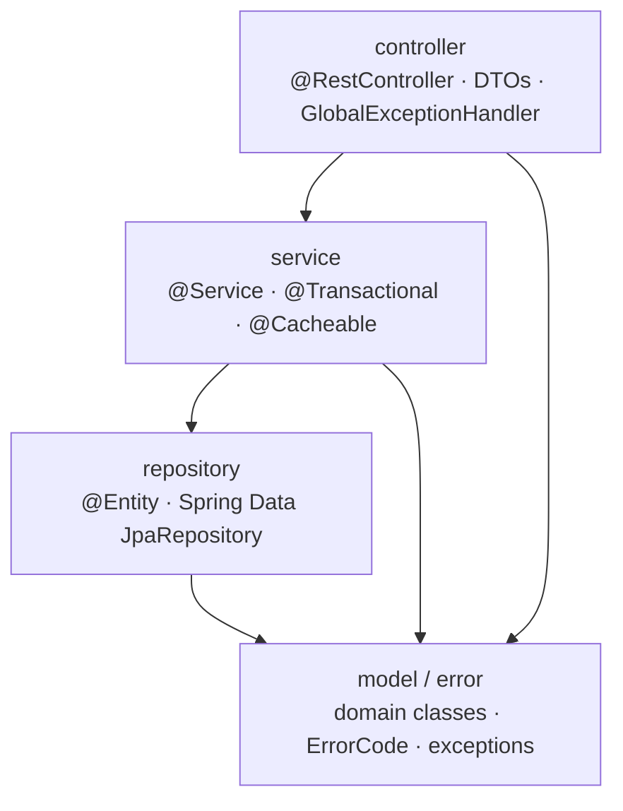
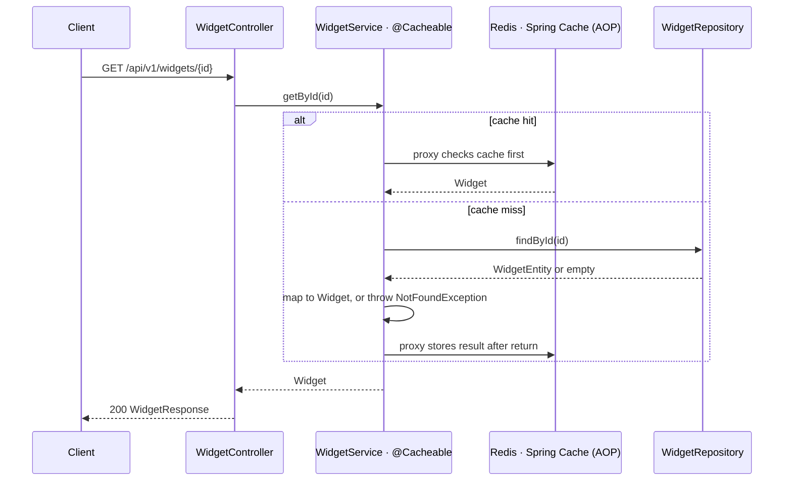
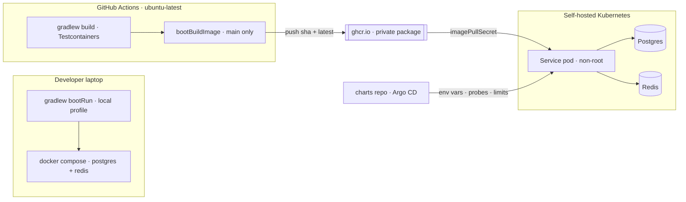

# Architecture Spine — Spring Boot Kotlin Starter Service

## Design Paradigm

**Spring-idiomatic layers, convention only — no build-time enforcement.** One top-level package per concern under the fixed root `com.hl.service`; every resource's classes live inside the concern package they belong to. Dependencies still point the conventional Spring direction (controller → service → repository), but nothing fails the build if a resource bends that — this Starter deliberately trades boundary enforcement for the least ceremony possible, and leaves cross-cutting architectural calls (transaction scope, cross-resource orchestration, entity ownership) to each Consumer Service's own developers rather than fixing them here. Testability is the one thing this paradigm still optimizes hard for: every layer is a plain class an in-memory fake or a real Testcontainer can exercise without a proxy or a container standing in the way.



## Invariants & Rules

*(AD-2, AD-3, AD-5, AD-6, AD-7, AD-12 are retired — see "Retired decisions" below. IDs are never reused.)*

### AD-1 — Fixed root package, one package per concern

- **Binds:** all
- **Prevents:** two resources landing the same kind of code in different trees; an agent inventing a fifth home.
- **Rule:** Root package is `com.hl.service` for every Consumer Service and is never renamed. Concern packages are `controller`, `service`, `repository`, `model`, `dto`, `error`, `config`. Each holds every resource's classes for that concern — there is no per-resource subpackage requirement, though a resource may group its own files with a shared filename prefix (`Widget*`) if a package grows large. This is a naming convention, not a boundary the build checks.

### AD-4 — Domain model and JPA entity are distinct types `[ADOPTED]`

- **Binds:** every persisted resource
- **Prevents:** Hibernate's mutable-`var`, no-arg-constructor and lazy-proxy semantics reaching the domain model and its business logic.
- **Rule:** The domain type is an immutable Kotlin class in `model/` (e.g. `Widget`). The `@Entity` lives in `repository/` next to its `JpaRepository` (e.g. `WidgetEntity`, `WidgetRepository`). Mapping between them is explicit hand-written code on the entity; no mapping framework is added.

### AD-8 — Identifiers are application-generated UUIDs

- **Binds:** every persisted entity
- **Prevents:** mixed identifier strategies, and ids that are null until flush leaking nullability through the immutable domain model.
- **Rule:** Ids are plain `java.util.UUID` (v4, `UUID.randomUUID()`), generated in the domain before persistence, on both the domain class and the `@Entity`. Postgres column type is `uuid`. The database never generates identifiers. *(Simplified from a per-resource value-class wrapper — flagged for Alex: this narrows a decision made before the simplicity direction; revisit if primitive-obsession bugs actually show up.)*

### AD-9 — One REST URL and verb convention

- **Binds:** every controller
- **Prevents:** per-resource path and versioning improvisation, and an auth matcher that cannot cleanly separate business routes from actuator.
- **Rule:** `/api/v1/{resource}`, plural lowercase. `POST` collection creates (201 + `Location`); `GET /{id}`; `GET` collection lists paged; `PUT /{id}` full update; `DELETE /{id}` returns 204. Request and response DTOs are `<Resource>Request` / `<Resource>Response` in `dto/`; the domain type is never serialized and never appears in a controller signature.

### AD-10 — One pagination contract, using Spring Data's own types

- **Binds:** every list endpoint
- **Prevents:** each resource inventing a list envelope.
- **Rule:** Offset paging via Spring Data's `Pageable`/`Page`, used directly end to end (controller → service → repository) — no hand-rolled pagination types. Response envelope: `items`, `page`, `size`, `totalElements`, `totalPages`, built once in `dto/` and reused by every resource.

### AD-11 — One error body, produced in exactly one place; three exception types, no catalogue `[ADOPTED]`

- **Binds:** every response path, FR-39, FR-40
- **Prevents:** a second error shape appearing for validation or for 500s; error responses being constructed in controllers or filters; each resource inventing its own status-mapping logic.
- **Rule:** Every 4xx and 5xx is RFC 7807 `application/problem+json`, built by the single `@RestControllerAdvice` (`GlobalExceptionHandler`, in `controller/`). Three exception types in `error/` carry the error content directly — there is no central `ErrorCode` catalogue. Each has exactly one constructor shape, `message: String, details: Map<String, Any?> = emptyMap()`:
  - `BusinessException` → 400
  - `NotFoundException` → 404
  - `SystemException` → 500

  `type` is `about:blank`; `instance` is the request path; `detail` is always the exception's own `message`; extension members are `code` (a fixed literal per exception **type** — `BUSINESS_ERROR` / `NOT_FOUND` / `SYSTEM_ERROR` — assigned by the matching `@ExceptionHandler`, never carried by the exception itself), `traceId`, `details` (the exception's map, omitted when empty), and — for Bean Validation failures (`@Valid`, unrelated to the three exception types) — `errors`, an array of `{field, code, message}`. **The message and details you pass to `SystemException` are echoed to the client, same as the other two types** — explicit user choice, overturning the earlier "500 bodies never leak detail" default. Every exception is still logged server-side too (`SystemException` at error level) with the same trace id, regardless of what reaches the client.
- **Trade-off accepted:** this replaces PRD FR-39's fine-grained, per-business-rule `ErrorCode` catalogue with 3 fixed type-level codes (+1 validation code). A client can no longer branch on, say, `WIDGET_ALREADY_EXISTS` vs. `WIDGET_LOCKED` by code alone — only by parsing `message`/`details`. A Consumer Service that needs finer client-branchable codes adds its own scheme; not fixed by this Starter (see Deferred).

### AD-13 — Redis is a hard dependency with no fallback path `[ADOPTED]`

- **Binds:** caching, readiness
- **Prevents:** a silently cold cache hiding a dead Redis, and per-resource disagreement about whether cache failures are recoverable.
- **Rule:** No `CacheErrorHandler` bean is registered, so Spring's default behavior already fails fast: a Redis failure propagates out of the `@Cacheable`/`@CacheEvict` call as an exception → 500. The Redis health contributor is a member of the **readiness** health group, so a pod without Redis never enters rotation. *(Overrides the PRD FR-10 assumption of degrade-to-Postgres; the mechanism is now the framework default rather than owned code.)*

### AD-14 — Flyway is the only schema authority

- **Binds:** all persistence
- **Prevents:** Hibernate and Flyway both claiming the schema; edited migrations diverging across environments.
- **Rule:** `spring.jpa.hibernate.ddl-auto` is `validate`. Migrations are `db/migration/V<n>__snake_case.sql`, sequential integers, never edited after merge. Checksum validation is on; auto-repair is off. Startup fails loudly on a missing or mismatched migration.

### AD-15 — All deployment-varying configuration comes from the environment

- **Binds:** all configuration
- **Prevents:** environment-specific values baked into the image, and a later Vault adoption becoming a code change.
- **Rule:** `application.yaml` holds defaults and environment-variable placeholders only. `application-local.yaml` is the sole file with literal (throwaway) credentials. The same image runs in any environment given different environment variables. No secret material anywhere else in the repo or the image.

### AD-16 — The Four Parameters, and nothing else, turn the Starter into a service `[ADOPTED]`

- **Binds:** parameterization
- **Prevents:** cloning drifting into source editing, which is the failure mode that would break the under-15-minute target.
- **Rule:** Only service name (Gradle project name), database name + credentials, HTTP port, and image name change. Each has exactly one documented home. The base package `com.hl.service` and the concern package names (AD-1) are invariant and are never touched.

### AD-17 — Observability is configuration, never code

- **Binds:** all runtime behavior
- **Prevents:** an observability code path that only exists in production and is therefore never tested.
- **Rule:** JSON logging uses Spring Boot's built-in structured logging (`logging.structured.format.console`) — no encoder dependency, no logback XML; the `local` profile keeps console output. Actuator exposes `health`, `info`, `prometheus` and nothing else, on the main port. Readiness group = datasource + Redis. Tracing is Micrometer Tracing over the OTel bridge with an OTLP exporter whose endpoint is unset by default, making it a no-op locally and in CI; sampling probability is a configuration value. Graceful shutdown is on with a 30s phase timeout. Heap is left to the buildpack's container-aware calculator; the README documents the knob. **Startup-to-readiness target is <10s (NFR-startup-time)**, measured via the documented local check (FR-32).

### AD-18 — The Auth Seam is one property, and it fails safe

- **Binds:** security
- **Prevents:** `spring-security` on the classpath silently securing everything with a generated password, and an enabled seam that allows all traffic through misconfiguration.
- **Rule:** `app.auth.enabled` (default `false`) selects one of two `SecurityFilterChain` beans. Disabled installs an **explicit** permit-all chain. Enabled requires a valid JWT on `/api/**` **and** `/v3/api-docs` (the OpenAPI JSON, which sits outside `/api/**` and would otherwise leak schema unauthenticated), leaves `/actuator/health**` open, and requires a token for every other actuator endpoint. Enabled without a resolvable `issuer-uri` fails context startup — it can never degrade to allow-all.

### AD-19 — The image is built by buildpacks from a pinned builder `[ADOPTED]`

- **Binds:** packaging, Kubernetes contract
- **Prevents:** a hand-maintained Dockerfile drifting per service; a floating builder tag breaking reproducibility.
- **Rule:** `bootBuildImage` only; no Dockerfile in the repo. The builder is `paketobuildpacks/builder-noble-java-tiny` pinned to an explicit tag. `BP_JVM_CDS_ENABLED` and AOT cache stay off in v1 (open Paketo defect on Java 25 + Boot 4). The image runs non-root, reads all configuration from the environment, answers the framework-default probe paths, and exits cleanly on SIGTERM within the shutdown timeout.

### AD-20 — CI shape and the registry `[ADOPTED]`

- **Binds:** the pipeline
- **Prevents:** integration tests reaching for infrastructure the repo does not start; publish credentials becoming a stored secret to rotate.
- **Rule:** GitHub Actions on `ubuntu-latest`. Every pull request runs `./gradlew build` — format check, Unit and Integration Tests — with Testcontainers and **no** workflow service containers; a failure blocks merge. Only `main` builds and pushes the image, to a **private** `ghcr.io` package, tagged with the git short SHA plus `latest`, authenticating with the workflow's built-in `GITHUB_TOKEN` under `permissions: packages: write`. The cluster pulls with an `imagePullSecret` owned by the charts repo. Gradle dependency and build caches are restored between runs.

### AD-21 — One test source set; containers are shared by a base class

- **Binds:** all tests
- **Prevents:** a new resource's Integration Test needing new infrastructure code, and per-test container startup blowing the pipeline budget.
- **Rule:** A single `src/test` source set. Integration Tests carry `@Tag("integration")`; Unit Tests use no container and no Spring context. One abstract base class owns static Postgres and Redis containers annotated `@ServiceConnection`, started once per JVM and shared; a resource's Integration Test extends it and adds nothing infrastructural. Isolation is per-test data cleanup, not per-test containers. Unit Tests use hand-written in-memory fakes for the repository; no mocking framework is a dependency.

### AD-22 — The version catalog pins only what the Boot BOM does not

- **Binds:** the build
- **Prevents:** version literals scattered in build files, and a duplicate pin drifting from the BOM.
- **Rule:** `gradle/libs.versions.toml` pins Kotlin, the Gradle plugins, springdoc and Spotless/ktlint. Flyway, Testcontainers, the Postgres driver, Micrometer, Lettuce, Spring Data Redis and Logback are declared without versions and inherited from the Spring Boot BOM. No dynamic (`+`, `latest.release`) version anywhere. The JVM is fixed by a Gradle toolchain, not the developer's local JDK.

### AD-23 — Kotlin compiler strictness

- **Binds:** the build, FR-2
- **Prevents:** Java sources creeping in, and nullability/warning drift going unnoticed as the codebase grows.
- **Rule:** `src/main` and `src/test` are Kotlin-only — no `.java` sources. The Kotlin compiler runs with `-Xjsr305=strict` (treats JSR-305 nullability annotations, e.g. on JDBC/JPA APIs, as strict Kotlin null-safety) and `allWarningsAsErrors = true` for the Starter's own module.

## Retired decisions

Kept for traceability; IDs are never reused. Superseded by the direction change to a Spring-idiomatic, non-enforced layering (2026-09-09).

- **AD-2** — ArchUnit dependency-direction enforcement. *Retired: no build-time boundary check remains; AD-1 is a naming convention only.*
- **AD-3** — The application layer sees exactly two Spring annotations. *Retired: the service layer may use whatever Spring it needs.*
- **AD-5** — Outbound-port-only interfaces per use case. *Retired: services call `JpaRepository` and cache-annotated methods directly.*
- **AD-6** — Cache-aside hand-orchestrated by the use case. *Retired, replaced by AD-13's `@Cacheable`/`@CacheEvict` approach.*
- **AD-7** — Transaction boundary and cache-population ordering rule. *Retired: transaction placement and cache/transaction interaction are left to each Consumer Service.*
- **AD-12** — Central `ErrorCode`/`ErrorKind` enum catalogue. *Retired: three fixed exception types replace it, folded into AD-11 (2026-09-09).*

## Consistency Conventions

| Concern | Convention |
| --- | --- |
| Packages | `com.hl.service.<concern>` (`controller`, `service`, `repository`, `model`, `dto`, `error`, `config`) — one package per concern, all resources inside it |
| Types | `Widget` (domain, in `model`) · `WidgetEntity` (JPA, in `repository`) · `WidgetRepository` (Spring Data interface, in `repository`) · `WidgetService` (in `service`) · `WidgetController` (in `controller`) · `WidgetRequest` / `WidgetResponse` (in `dto`) |
| URLs | `/api/v1/{plural-resource}`; actuator stays on `/actuator/**` |
| Identifiers | UUID v4, application-generated, plain `java.util.UUID`, `uuid` column |
| Dates | `java.time` types; UTC; ISO-8601 on the wire; `timestamptz` in Postgres |
| Errors | RFC 7807 `application/problem+json`; `BusinessException`/`NotFoundException`/`SystemException` (message + optional `details` map) → 400/404/500; `code`/`traceId`/`details` extension members, `errors` for Bean Validation only; one `@RestControllerAdvice`; message/details always echoed to the client, including for 500s |
| Lists | Spring Data `Pageable`/`Page` end to end → `{items, page, size, totalElements, totalPages}` |
| Migrations | `db/migration/V<n>__snake_case.sql`, sequential, immutable after merge; tables plural snake_case |
| Caching | `@Cacheable`/`@CacheEvict` directly on the service method; no owned cache-orchestration code |
| Transactions | No fixed placement rule; a Consumer Service decides its own boundary (the example uses `@Transactional` on the service method conventionally) |
| Config | Environment variables / externalized config only; literals confined to `application-local.yaml` |
| Logging | Built-in structured JSON to stdout in non-`local` profiles, with trace and span ids; console output in `local` |
| Tests | `<Class>Test` (unit, no container) · `<Class>IT` with `@Tag("integration")` extending the container base class · JUnit 5 + AssertJ · hand-written fakes |
| Image tags | Postgres and Redis tags declared once in the root `.env`, consumed by both Compose and Testcontainers |

## Stack

| Name | Version |
| --- | --- |
| JDK (Gradle toolchain) | 25 LTS |
| Kotlin | 2.4.0 |
| Spring Boot | 4.1.1 |
| Gradle (wrapper) | 9.7.1 |
| springdoc-openapi (`springdoc-openapi-starter-webmvc-ui`) | 3.1.1 |
| Spotless Gradle plugin / ktlint | 8.10.2 / 1.5.0 |
| Postgres, Redis, Flyway, Testcontainers, Micrometer, Lettuce, Spring Data Redis | managed by the Spring Boot BOM |
| Buildpack builder | `paketobuildpacks/builder-noble-java-tiny`, explicit tag |

Boot 4 renames that invalidate Boot 3 recall — the catalog is authoritative: the web starter is `spring-boot-starter-webmvc`; test starters are per-technology (`spring-boot-starter-<tech>-test`); Jackson 3 lives under group `tools.jackson`; the baseline is Jakarta EE 11 / Servlet 6.1 on Spring Framework 7. Liveness and readiness probes are enabled by default.

## Structural Seed

```text
hl-backend-kotlin-starter/
  .env                                  # postgres + redis image tags, single source
  docker-compose.yaml                   # postgres + redis only
  gradle/libs.versions.toml
  .github/workflows/ci.yaml
  src/main/kotlin/com/hl/service/
    StarterApplication.kt
    controller/
      WidgetController.kt
      GlobalExceptionHandler.kt         # @RestControllerAdvice, AD-11
    service/
      WidgetService.kt                  # @Service, @Transactional, @Cacheable/@CacheEvict
    repository/
      WidgetRepository.kt               # Spring Data JpaRepository<WidgetEntity, UUID>
      WidgetEntity.kt                   # @Entity, maps to/from Widget
    model/
      Widget.kt                         # plain immutable domain class
    dto/
      WidgetRequest.kt
      WidgetResponse.kt
      PageResponse.kt                   # shared {items,page,size,totalElements,totalPages}
    error/
      AppException.kt                   # sealed base: message, details map
      BusinessException.kt              # -> 400
      NotFoundException.kt              # -> 404
      SystemException.kt                # -> 500
    config/
      SecurityConfig.kt                 # Auth Seam, AD-18
  src/main/resources/
    application.yaml                    # defaults + env placeholders
    application-local.yaml              # the only literal credentials
    db/migration/V1__create_widgets.sql
  src/test/kotlin/com/hl/service/
    support/IntegrationTestBase.kt      # shared @ServiceConnection containers
    ...                                 # mirrors the main tree
```

Read-by-id, the path every resource copies — the cache is entirely framework-managed, so this is the whole flow:



Operational envelope — where the image goes and who supplies its configuration:



## Capability → Architecture Map

| Capability / Area | Lives in | Governed by |
| --- | --- | --- |
| Build and language baseline (FR-1–FR-3) | `build.gradle.kts`, `gradle/libs.versions.toml` | AD-22, AD-23 |
| Package and layer conventions (FR-4–FR-6) | package tree | AD-1 |
| Persistence — Postgres and Flyway (FR-7–FR-9) | `repository/`, `db/migration` | AD-4, AD-8, AD-14, AD-15 |
| Caching — Redis (FR-10–FR-12) | `service/` (`@Cacheable`/`@CacheEvict`) | AD-13 |
| Example Slice `widgets` (FR-13–FR-15) | `Widget*` classes across `controller/service/repository/model/dto` | AD-1, AD-4, AD-9, AD-21 |
| REST conventions and error model (FR-16–FR-18, FR-39–FR-40) | `controller/`, `error/` | AD-9, AD-10, AD-11, AD-18 |
| Observability and runtime (FR-19–FR-24) | `application.yaml`, actuator | AD-15, AD-17 |
| Local development (FR-25–FR-27) | `docker-compose.yaml`, `.env`, `application-local.yaml` | AD-15, AD-17, `.env` convention |
| Image and CI (FR-28–FR-31) | `.github/workflows/ci.yaml`, `bootBuildImage` config | AD-19, AD-20 |
| Kubernetes runtime contract (FR-32) | image behavior | AD-17, AD-19 |
| Parameterization (FR-33–FR-35) | README checklist | AD-1, AD-16 |
| Auth Seam (FR-36–FR-37) | `config/SecurityConfig.kt` | AD-18 |
| Documentation (FR-38) | `README.md` | AD-16, AD-21 |

## Deferred

- **Cross-resource orchestration and transaction scope** — the Starter's example is a single resource with a single-step read/write path; how a Consumer Service composes multiple resources into one transaction, or calls across resources, is not fixed here. Decide per Consumer Service.
- **Cross-resource identifier reuse and entity ownership** — no convention for whether one resource references another's id inline versus owning a copy. Decide per Consumer Service.
- **Fine-grained, client-branchable error codes** — AD-11 gives only 3 fixed type-level codes (`BUSINESS_ERROR`/`NOT_FOUND`/`SYSTEM_ERROR`) plus a validation code; there is no per-business-rule catalogue (this narrows PRD FR-39's original ask — see AD-11's accepted trade-off). A Consumer Service that needs clients to branch on a specific business rule (not just message text) adds its own scheme on top of `details`. Not fixed here.
- **Service generator / rename automation** — the README checklist is the v1 mechanism and is written to be its future spec. AD-16 keeps the parameter surface small enough that a generator stays cheap to add.
- **Helm charts, Argo CD config, Kubernetes manifests** — separate repository; the image contract in AD-17/AD-19 is the interface between them.
- **Vault** — AD-15 is the whole preparation; adoption is wiring, not code.
- **Auth0 and enforced authorization** — AD-18 is the seam; issuer, audience, per-service claims, and how Integration Tests authenticate are decided when auth is actually adopted, and audience may become a fifth parameter then.
- **Messaging, gRPC, a second datasource, multi-module build** — a Consumer Service adds these itself; nothing in this spine forecloses them.
- **Cursor/keyset pagination** — AD-10 is offset paging; revisit per-resource when a collection outgrows it.
- **Buildpack CDS / AOT cache and native image** — blocked on the open Paketo defect (AD-19); revisit when it closes.
- **Separate actuator management port** — AD-17 keeps actuator on the main port; revisit if the Auth Seam's matcher proves awkward.
- **detekt, coverage gates, mutation testing** — additive Gradle configuration, not a structural change.
- **Semver image tags and a pull-through upgrade mechanism for existing Consumer Services** — AD-20 ships SHA + `latest` only.
- **Per-code documentation `type` URIs in Problem Details** — AD-11 uses `about:blank`; adding real URIs later is additive because clients branch on `code`.
- **A local OpenTelemetry collector in the Compose Stack** — add a collector plus a trace UI when someone actually needs to read a local trace.
